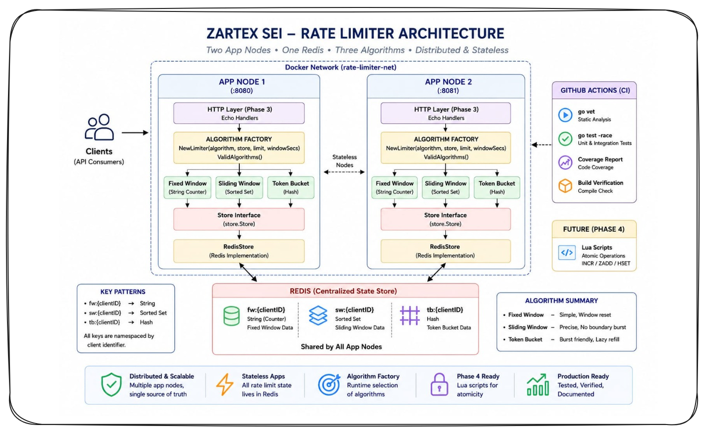

# sei-ratelimiter

Distributed Rate Limiter as a Service — Zartex SEI Project 1

---

## Architecture


---

## Algorithms

- Fixed Window
- Sliding Window
- Token Bucket

---

## API Reference

### POST /check

Checks whether request is allowed.

### POST /rules

Create a new rule.

### GET /rules

Get all rules.

### GET /rules/:id

Get rule by ID.

### DELETE /rules/:id

Delete rule.

---

## How To Run

Coming soon.

---

## How To Run Tests

Coming soon.

---

## Benchmarks

Coming soon.

---

## Failure Modes

Coming soon.

---

## What We Would Do at 10x Scale

Coming soon.


## How To Run

### Prerequisites

- Docker Desktop
- WSL2 enabled
- Git

### Start the full stack

```bash
git clone git@github.com:Zartex-the-art/sei-ratelimiter.git
cd sei-ratelimiter
docker compose up --build
```

This starts:

- App Node 1 → http://localhost:8080
- App Node 2 → http://localhost:8081
- Redis → localhost:6379

### Verify

```bash
curl http://localhost:8080/health
curl http://localhost:8081/health
```

Both should return:

```json
{"status":"ok"}
```

### Stop

```bash
docker compose down
```

## Project Structure

```text
sei-ratelimiter/
├── cmd/
│   └── server/                  # Entry point — wires packages, starts server
│       └── main.go
│
├── internal/
│   ├── algorithms/              # Rate limiting logic
│   │   ├── limiter.go           # Limiter interface
│   │   ├── fixed_window.go      # Fixed Window algorithm
│   │   ├── fixed_window_test.go # Fixed Window tests
│   │   ├── sliding_window.go    # Sliding Window (Phase 2)
│   │   └── token_bucket.go      # Token Bucket (Phase 2)
│   │
│   ├── api/                     # HTTP handlers
│   ├── config/                  # Environment variable loading
│   ├── store/                   # Redis client/store layer
│   └── testhelpers/             # Shared test utilities
│
├── tests/
│   └── load/                    # k6 load test scripts
│
├── docs/
│   ├── decisions/               # Architecture Decision Records
│   │   ├── 0000-template.md
│   │   ├── 0001-go-language-choice.md
│   │   ├── 0002-concurrency-model.md
│   │   ├── 0002-infrastructure-tooling.md
│   │   ├── 0003-package-structure.md
│   │   └── 0004-fixed-window-first.md
│   │
│   ├── diagrams/                # Architecture diagrams
│   │   ├── architecture-v1.png
│   │   ├── architecture-v2.png
│   │   ├── architecture-v3.png
│   │   ├── architecture-v4.png
│   │   └── fixed-window-sequence.png
│   │
│   ├── ARCHITECTURE.md
│   ├── CONCURRENCY.md
│   ├── DOCKER_CONCEPTS.md
│   ├── REDIS_KEY_DESIGN.md
│   ├── SHARED_STATE.md
│   ├── TEST_CONVENTIONS.md
│   └── TEST_STRATEGY.md
│
├── .github/
│   └── workflows/               # GitHub Actions CI
│
├── pkg/
├── practice/
│   ├── goroutine.go
│   ├── mutex.go
│   └── race.go
│
├── .env.example
├── .gitignore
├── docker-compose.yml
├── Dockerfile
├── go.mod
├── README.md
├── server_test.go
└── SPRINT_LOG.md
```


## Fixed Window Algorithm

The Fixed Window algorithm limits requests within a fixed time duration.

Example:
- Limit: 5 requests
- Window: 60 seconds

Flow:
1. Client sends request
2. Redis counter increments using INCR
3. Redis EXPIRE sets TTL on first request
4. If count <= limit:
   request allowed
5. Else:
   request blocked

Redis Commands:
- INCR
- EXPIRE

Advantages:
- Simple
- Fast
- Low memory usage

Tradeoff:
Fixed Window suffers from the Boundary Burst problem.
A client can send requests at the end of one window and beginning of another window, effectively doubling request rate.

Best Use Cases:
- Simple APIs
- Low complexity systems
- Basic rate limiting

### Fixed Window — Redis Implementation (Day 7)

What changed from in-memory (Day 6):

- Counter stored in Redis — shared by all app nodes
- Both nodes read from and write to the same key: fw:{clientID}
- State survives app restarts (Redis persists via AOF)
- Global limit now enforced correctly across the cluster

Redis commands:

- INCR fw:{clientID} increments counter, returns new value
- EXPIRE fw:{clientID} {windowSecs} sets TTL (batched in pipeline)

Pipeline note:

- INCR and EXPIRE are sent together in one round-trip (pipeline).
- This is not atomic — see boundary burst limitation.
- Lua script replaces this in Phase 4 for true atomicity.

Design — Dependency Injection:

- FixedWindow does not create a Redis client directly.
- It accepts a Store interface — injected at startup.
- Unit tests inject FakeStore (no Redis needed).
- Production injects RedisStore.

This pattern is used for all three algorithms.


### Sliding Window Log

Eliminates the boundary burst problem by tracking exact request timestamps.

Every request in the last N seconds is counted precisely.

How it works:

1. ZADD sw:{clientID} {timestamp_ms} {unique_member} — record request
2. ZREMRANGEBYSCORE sw:{clientID} 0 {now-window_ms} — prune old entries
3. ZCOUNT sw:{clientID} 0 +inf — count in window
4. count <= limit: allow. count > limit: ZREM + block.

Redis key: sw:{clientID}

Score: unix timestamp in milliseconds (float64)

Member: nanosecond timestamp string (unique per request)

Why no boundary burst:

At t=61s with a 60s window, requests from t=1s to t=61s are all counted.

There is no clock reset moment. The window slides continuously.

A client cannot exploit a boundary — every second is treated equally.

Memory tradeoff:

Each request in the current window occupies one sorted set entry.

High-traffic clients: 1000 req/min x 60s window = 1000 entries.

Fixed window: always 1 entry per client regardless of traffic.

When to use:

Billing APIs, security-critical endpoints, any place where a 2x burst would cause real harm or incorrect billing.

Known limitation:

ZADD + ZREMRANGEBYSCORE + ZCOUNT are 3 separate commands.

Not atomic — Phase 4 Lua scripts fix this.


## Algorithm Comparison

| Property | Fixed Window | Sliding Window | Token Bucket |
|----------|---------------|----------------|---------------|
| Redis data type | String | Sorted Set | Hash |
| Memory per client | O(1) | O(requests in window) | O(1) |
| Boundary burst | Yes (bug) | No | No |
| Burst allowance | No | No | Yes |
| Complexity | Low | Medium | Medium |
| Best for | Simple APIs | Precision-critical | Bursty clients |
| Implemented | Day 6-7 | Day 8 | Day 9 |


| Property | Fixed Window | Sliding Window |
|---|---|---|
| Redis data type | String (INCR + EXPIRE) | Sorted Set |
| Memory per client | O(1) | O(requests in window) |
| Boundary burst | YES | NO |
| Window reset | Fixed clock tick | Continuous |
| Implementation | Simple | Medium |
| Best for | Simple APIs | Billing/Security |


| Property          | Fixed Window | Sliding Window        | Token Bucket         |
| ----------------- | ------------ | --------------------- | -------------------- |
| Redis data type   | String       | Sorted Set            | Hash                 |
| Memory per client | O(1)         | O(requests in window) | O(1)                 |
| Boundary burst    | Yes          | No                    | No                   |
| Burst allowance   | No           | No                    | Yes — up to limit    |
| Refill model      | Window reset | Continuous pruning    | Continuous token add |
| Implementation    | Simple       | Medium                | Medium               |
| Best for          | Simple APIs  | Precision-critical    | Bursty API clients   |


| Property          | Fixed Window    | Sliding Window        | Token Bucket         |
| ----------------- | --------------- | --------------------- | -------------------- |
| Redis data type   | String          | Sorted Set            | Hash                 |
| Memory per client | O(1)            | O(requests in window) | O(1)                 |
| Boundary burst    | Yes             | No                    | No                   |
| Burst allowance   | No              | No                    | Yes                  |
| Refill model      | Window reset    | Continuous pruning    | Continuous token add |
| Implementation    | Simple          | Medium                | Medium               |
| Best for          | Simple APIs     | Precision-critical    | Bursty API clients   |
| Phase 4 atomicity | Lua INCR+EXPIRE | Lua ZADD+ZREM+ZCOUNT  | Lua HGETALL+HSET     |
| Status            | Done            | Done                  | Done                 |


Why Token Bucket?
Fixed Window is simple and memory-efficient but allows boundary burst problems.
Sliding Window improves precision by tracking request timestamps, but memory usage grows with traffic.
Token Bucket allows controlled bursts while maintaining an average request rate over time.
This makes Token Bucket useful for real-world APIs where short bursts are acceptable but long-term abuse must still be prevented.

In this project:
- Fixed Window demonstrates simple rate limiting
- Sliding Window demonstrates precise fairness
- Token Bucket demonstrates burst-tolerant rate limiting
These implementations together show tradeoffs between simplicity, precision, memory usage, and client experience.


## Architecture


Two app nodes share one Redis instance.
All rate limit state is in Redis — nodes are stateless.
Algorithm factory selects the correct algorithm at runtime.


## API Documentation

### POST /check

See detailed API documentation:
- [POST /check API](docs/api/check.md)

- [POST /rules and GET /rules API](docs/api/rules.md)


## How To Run

### Prerequisites
- Docker Desktop with WSL2 integration enabled
- Git
- Go 1.22.4 (for running tests locally)

### Start the full stack
```bash
git clone git@github.com:Zartex-the-art/sei-ratelimiter.git
cd sei-ratelimiter
docker compose up --build
```
This starts:

App Node 1: http://localhost:8080
App Node 2: http://localhost:8081
Redis:       localhost:6379

Verify
curl http://localhost:8080/health
# {"status":"ok","node":"node-1"}

curl http://localhost:8081/health
# {"status":"ok","node":"node-2"}

Stop
docker compose down

How To Run Tests

Unit tests (no Redis required)
go test -race -v ./internal/algorithms/... ./internal/handlers/...

Integration tests (requires docker compose up)
docker compose up -d
REDIS_URL=localhost:6379 go test -race -v ./...
docker compose down
Full test harness (recommended)
./scripts/run_tests.sh

Coverage report
REDIS_URL=localhost:6379 go test -race -coverprofile=coverage.out ./...
go tool cover -html=coverage.out

Manual API test
docker compose up -d
./scripts/test_api.sh
docker compose down


## Distributed Correctness

This rate limiter is designed to enforce limits correctly across
multiple nodes sharing one Redis instance. Correctness is guaranteed
at three levels:

### Level 1 — Single-Node Concurrency

Within a single node, multiple goroutines call Allow() concurrently.
Go's race detector verifies no data races.
All tests run with go test -race.

### Level 2 — Multi-Node Shared State

Both app nodes write to the same Redis keys.
Redis INCR is atomic — each node gets a unique return value.
No node can see a stale count.

### Level 3 — Atomic Read-Modify-Write (Phase 4)

INCR and EXPIRE must execute as one unit.
If INCR succeeds but EXPIRE fails (node crash), the key never expires.
Lua scripts fix this: Redis executes the full script atomically.
No other command can run between INCR and EXPIRE inside a Lua script.

### Verification
TestFixedWindow_AtomicUnderConcurrency: 300 goroutines, limit=50.
Exactly 50 allowed across all 300 concurrent requests.
Run 5 times: go test -race -count=5 -run TestFixedWindow_Atomic ./internal/
algorithms/...


## API Reference

### POST /check — Evaluate Rate Limit

Request:
```json
{"client_id": "user-1", "algorithm": "fixed_window", "limit": 10, "window_secs": 60}
```

Config resolution: if client_id has a stored rule, omit other fields:
```json
{"client_id": "user-1"}
```

Response (200):
```json
{"allowed": true, "remaining": 9, "algorithm": "fixed_window", "client_id": "user-1"}
```

POST /rules — Create Rate Limit Rule

Request:
```json
{"client_id": "user-1", "algorithm": "fixed_window", "limit": 10, "window_secs": 60, 
"enabled": true}
```

Response (201):
```json
{"id": "uuid", "client_id": "user-1", "algorithm": "fixed_window", "limit": 10, 
"window_secs": 60, "enabled": true, "created_at": "..."}
```

GET /rules — List All Rules
Response (200): {"rules": [...]}

GET /rules/:id — Get One Rule
Response (200): full rule object
Response (404): {"error": "rule not found"}

DELETE /rules/:id — Delete a Rule
Response (204): no body
Response (404): {"error": "rule not found"}


## Distributed Correctness Verification

### What We Test
With two nodes sharing one Redis, we verify:
1. The global limit is never exceeded regardless of which node serves requests
2. No over-counting — atomic Lua scripts prevent race conditions
3. No under-counting — every request is evaluated correctly

### Atomicity Tests (per algorithm)
Run 300 concurrent goroutines against a limit of 50:
go test -race -count=5 -run "TestFixedWindow_AtomicUnderConcurrency" ./...
go test -race -count=5 -run "TestSlidingWindow_AtomicUnderConcurrency" ./...
go test -race -count=5 -run "TestTokenBucket_AtomicUnderConcurrency" ./...
Expected: exactly 50 allowed across 300 goroutines, every run.

### k6 Correctness Test (cross-node)
Runs 10 VUs across both nodes for 60 seconds:
make correctness-test
Expected: total allowed <= (duration / window) × limit + 1 window buffer.

